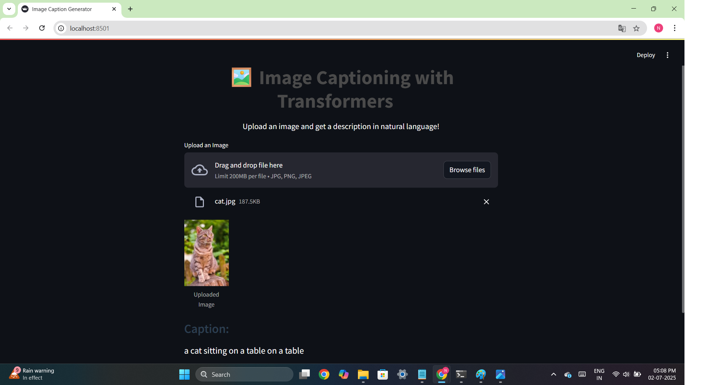
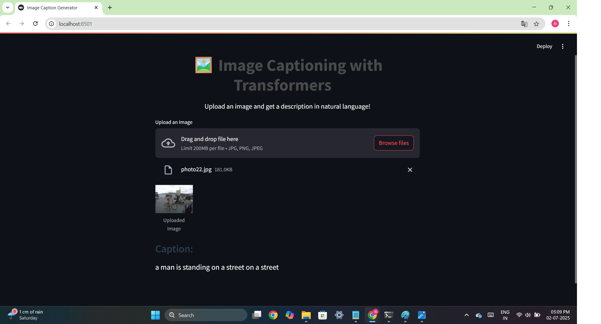
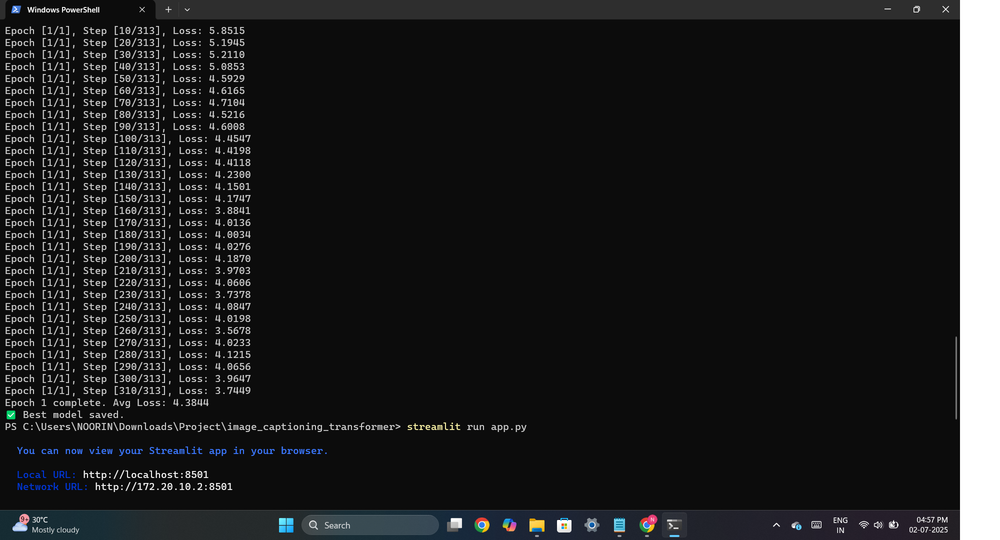

# 🖼️ Image Captioning with Transformers

A deep learning project that generates natural language captions for images using a CNN encoder and Transformer-based decoder with attention.

## 🔧 Tech Stack
- PyTorch
- Transformer Decoder (Self-Attention + Cross-Attention)
- CNN Encoder (ResNet or ViT)
- MSCOCO Captions Dataset
- Streamlit UI

## 📦 Dataset
- MSCOCO 2017 Captions
- Download: https://cocodataset.org/#download

## 📁 Project Structure

image-captioning-transformer/

├── app.py                        # Streamlit UI app

├── train.py                     # Training loop

├── infer.py                     # Caption generation script

├── build_vocab.py               # Builds tokenizer vocab

├── download_coco_subset.py      # Downloads 1000 COCO images (300MB)

│

├── models/

│   ├── encoder.py               # CNN encoder (ResNet)

│   ├── decoder.py               # Transformer decoder

│   └── image_captioning.py      # Full encoder-decoder model

│

├── utils/

│   ├── tokenizer.py             # Custom tokenizer class

│   └── dataset.py               # COCO Dataset wrapper

│

├── config/

│   └── config.yaml              # All hyperparameters and paths

│

├── data/

│   └── raw/                     # Downloaded images & captions

│       ├── train2017_subset/

│       └── captions_subset.json

│

├── checkpoints/                 # Saved model weights

│

├── requirements.txt             # Python dependencies

└── README.md                    # You are here

## 🚀 Run Instructions

bash
# Step 1: Install requirements
pip install -r requirements.txt

# Step 2: Train the model
python train.py

# Step 3: Run the app
streamlit run app.py

## 🌐 Demo
Upload an image and get a natural caption in real-time!

## ✨ Features
- Transformer-based captioning
- Interactive Streamlit web interface
- Easy deployment-ready

## 📸 Demo Screenshots

### 🖥️ Streamlit Web App

---

### 🧾 Terminal Output

## 👩‍💻 Author:
Noorin Nasir Khot
